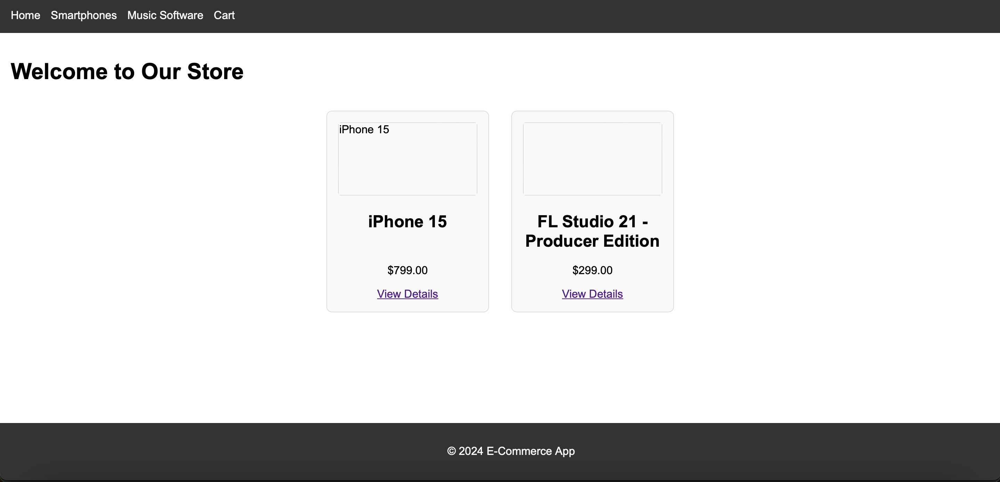
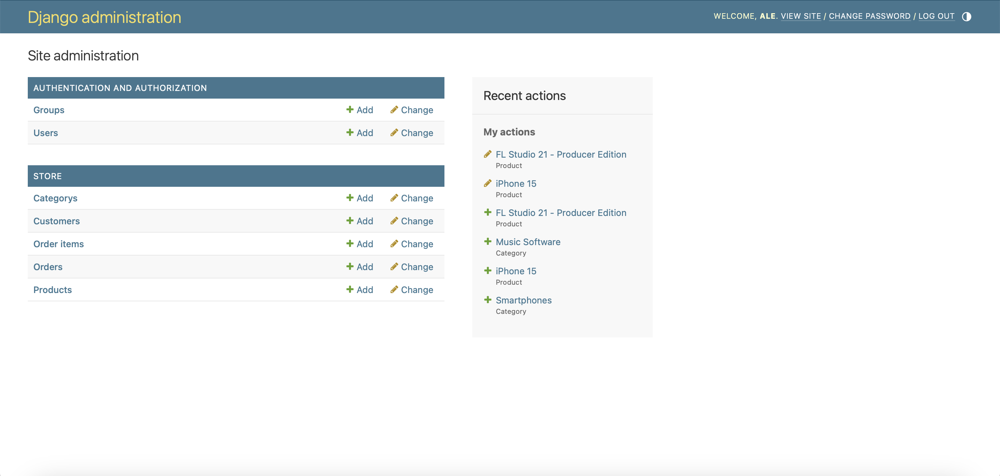

# simple_Ecommerce
## General Information
### Project Goals
The goal for this project is to simply understand the 
functioning of the Django framework coming from a background
in Flask.
### Flask vs Django
Overall the 2 frameworks are quite similar but Flask is a lot
more straight-forward to get use to. Though, Django offers 
more built-in default modules like Django Admin module and 
more. Although with a steeper understanding curve, Django 
seems more powerful and ultimately faster with developing 
structured web applications where database logic is needed.
### Project Description
The application is a simple eCommerce as you can tell by the
name. As of now, there is a simple store application that 
contains a list of the products listed for sale. The store 
front-end is linked to a sqlite database of products.
### Further Work and Scaling
Instead of a simple html page rendered we can return a whole
react application built with front-end components so that the
website front-end is more scalable and structured. Also in the
deploying phase we can arrange the system in separated 
kubernetes nodes for distribution principles. The database can
also be improved, and buy and shopping cart features are 
missing. In addition, the frontend UI sucks but it wasn't the 
main point of this project.







## Development
### Backend
```console
cd backend
pip install -r requirements.txt
python manage.py runserver
```
### Frontend

```console
cd frontend
npm install
npm start
```
## Deployment
It's possible to either deploy frontend and backend separately on 2 different physical or cloud machines, or deploy them on a single computer. For real-life scenario, separate deployment is often preferred for distribution of the resources, and oftentimes for project or enterprise size, single applications are deployed separately as even smaller microservices.